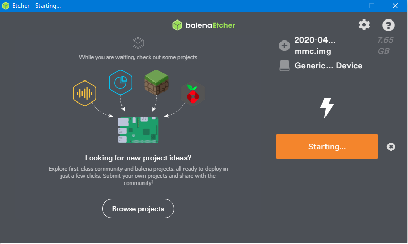

# BananaPI

## Hardware-Specification
> The Banana Pi BPI-M2 Zero has the following Specification: http://wiki.banana-pi.org/Banana_Pi_BPI-M2_ZERO  

## Operating System
> OS-Images: https://drive.google.com/drive/folders/0B_YnvHgh2rwjNExjUmlRNXdVNUE

### Installing image: '2020-04-10-raspbian-jessie-ap6212-bpi-m2z-sd-emmc'

1. Download image and unpack ZIP-file.
2. Select file '2020-04-23-raspbian-stretch-bpi-m2p-sd-emmc.img' and store it with 'belenaEtcher' to SD-Card

https://haarer.github.io/linux/embedded/arm/allwinner/%22banana/pi/zero%22/2018/03/03/testing-banana-pi-m2-zero.html

http://wiki.banana-pi.org/Getting_Started_with_M2_Zero

